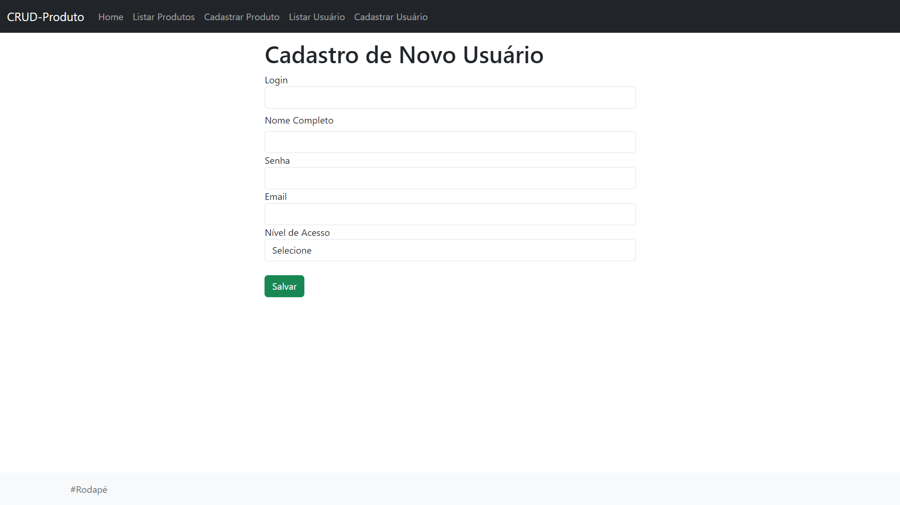

<h1 align="center"> Sistema CRUD em PHP </h1>

## :memo: Descrição
Foram desenvolvidas as funcionalidades de cadastro, listagem, edição e exclusão de usuários. O cadastro permitia o registro de novos usuários no sistema, enquanto a listagem exibia todos os usuários cadastrados. A funcionalidade de edição possibilitava a atualização dos dados, garantindo que as informações estivessem sempre atualizadas. Além disso, a exclusão permitia a remoção permanente dos registros de usuários, assegurando um gerenciamento completo e eficiente

## :books: Funcionalidades
- **Usuários**
  - Cadastro de usuários
  - Listagem de usuários
  - Edição de informações do usuário
  - Exclusão de usuários

## :wrench: Tecnologias utilizadas

 
    

## Estrutura do Projeto

- `home.php`: Página inicial do sistema
- `cadastrarUsuarios.php`: Formulário para cadastro de usuários
- `listarUsuarios.php`: Tela para listar todos os usuários cadastrados
- `editarUsuario.php`: Função para editar usuários existentes
- `excluirUsuario.php`: Tela para exclusão de usuários

## 📷 Preview

## Cadastro De Novo Usuário

## Listagem de Usuários

## 🧑‍🏫 Aprendizados
Desenvolvendo este projeto, aprendi uma série de habilidades valiosas. Trabalhar com PHP e MySQL permitiu que eu compreendesse a fundo a manipulação de dados, criando, lendo, atualizando e excluindo informações em um banco de dados, além de entender como a interação entre backend e banco de dados se dá na prática.

Outro ponto importante foi o aprendizado sobre o gerenciamento de estado e a lógica por trás das funcionalidades, como o cadastro e a edição de usuários. Cada etapa demandou atenção para garantir que as operações ocorressem da maneira esperada, com validações adequadas, permitindo um fluxo correto do sistema. Ao trabalhar na interface web, também aprimorei minhas habilidades em criar uma boa experiência de usuário, garantindo que todas as funcionalidades estivessem facilmente acessíveis e fossem intuitivas.
